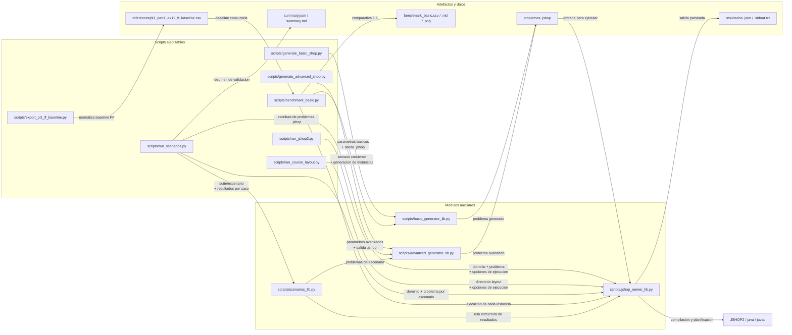
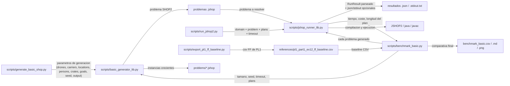
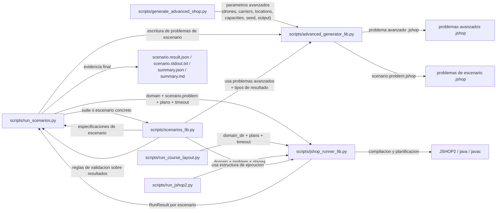

# Guia de scripts de PL2 - `Lets_go_SHOPing`

Este documento explica **para que sirve cada script del directorio `scripts/`**, que hace, que salida produce y para que sirve esa salida dentro de la practica.

## Como leer esta guia

- `CLI`: script pensado para ejecutarse desde terminal.
- `Modulo auxiliar`: fichero Python reutilizado por otros scripts; no es una herramienta de consola por si solo.
- Cuando un modulo auxiliar no tiene salida propia, aqui se documenta **que devuelve** o **que ficheros ayuda a generar**.

## Tabla resumen

| Script | Tipo | Sirve para | Ejercicio / necesidad |
| --- | --- | --- | --- |
| `scripts/generate_basic_shop.py` | CLI | Generar problemas SHOP2 del dominio basico | Ejercicio 1.1: generar problemas de tamano creciente |
| `scripts/generate_advanced_shop.py` | CLI | Generar problemas SHOP2 del dominio avanzado | Ejercicio 1.2: explorar problemas avanzados aleatorios |
| `scripts/run_jshop2.py` | CLI | Ejecutar JSHOP2 sobre cualquier dominio y problema | Ejercicios 1.1 y 1.2: resolver problemas y mostrar planes |
| `scripts/run_course_layout.py` | CLI | Ejecutar el layout fijo del bundle del profesor | Soporte y compatibilidad con el entorno de la asignatura |
| `scripts/run_scenarios.py` | CLI | Ejecutar la bateria determinista de 1.2 | Ejercicio 1.2: demostrar que se cubren las situaciones obligatorias |
| `scripts/benchmark_basic.py` | CLI | Hacer el benchmark del dominio basico | Ejercicio 1.1: crecimiento temporal, grafica y comparativa con PL1 |
| `scripts/export_pl1_ff_baseline.py` | CLI | Normalizar la baseline FF de PL1 | Soporte del ejercicio 1.1: mantener correcta la comparativa |
| `scripts/basic_generator_lib.py` | Modulo auxiliar | Implementar el generador basico | Base del ejercicio 1.1 |
| `scripts/advanced_generator_lib.py` | Modulo auxiliar | Implementar el generador avanzado | Base del ejercicio 1.2 |
| `scripts/jshop_runner_lib.py` | Modulo auxiliar | Ejecutar, parsear y serializar resultados de JSHOP2 | Base comun de 1.1 y 1.2 |
| `scripts/scenarios_lib.py` | Modulo auxiliar | Definir y validar los escenarios de 1.2 | Criterio de aceptacion del ejercicio 1.2 |

## Diagramas de dependencia y cohesion

### Mapa global

- Este mapa muestra dependencia entre archivos y el tipo de informacion que circula entre ellos.
- No representa llamadas entre CLIs porque practicamente no existen; la cohesion real es por modulos compartidos.
- El acoplamiento con el planificador esta concentrado en `scripts/jshop_runner_lib.py`.

### Flujo de 1.1

- `benchmark_basic.py` depende de `basic_generator_lib.py` para crear instancias y de `jshop_runner_lib.py` para medirlas.
- `export_pl1_ff_baseline.py` no es llamado por `benchmark_basic.py`; solo genera el CSV que luego el benchmark consume.
- La salida de cohesion de 1.1 se concentra en tres piezas: generador basico, runner comun y baseline normalizada.

### Flujo de 1.2

- `run_scenarios.py` es el coordinador de 1.2: selecciona escenarios, genera cada problema, ejecuta JSHOP2 y resume resultados.
- `scenarios_lib.py` concentra el contrato funcional: define casos, describe que esperar y valida la salida.
- `run_course_layout.py` y `run_jshop2.py` comparten el mismo runner, pero no se llaman entre si.

### Lectura rapida de cohesion

- No hay una cadena normal de `script -> script -> script`; casi toda la cohesion es `CLI -> modulo auxiliar`.
- `scripts/basic_generator_lib.py` cohesiona la generacion de 1.1.
- `scripts/advanced_generator_lib.py` y `scripts/scenarios_lib.py` cohesionan la generacion y validacion de 1.2.
- `scripts/jshop_runner_lib.py` es el punto comun de acoplamiento con JSHOP2 y con la serializacion de resultados.

## Scripts ejecutables

### `scripts/generate_basic_shop.py`

- **Para que sirve:** genera un problema en formato SHOP2 para el dominio basico.
- **Que hace:** recibe por parametros el numero de drones, localizaciones, personas, cajas y necesidades; construye un `defproblem` de SHOP2 y lo escribe en un fichero `.jshop`.
- **Que pregunta del enunciado cubre:** responde a la parte de 1.1 que pide *modificar el generador de la Practica 1 para producir problemas en formato SHOP2* y generar instancias de tamano creciente.
- **Salida en consola:** imprime solo la ruta del fichero generado.
- **Ficheros que genera:** un `.jshop`.
- **Que contiene esa salida:** un problema con:
  - nombre del problema
  - objetos `drone`, `location`, `person`, `crate` y `content`
  - estado inicial
  - predicados `(need person content)`
  - tarea raiz `((deliver-all))`
- **Para que sirve esa salida en la practica:** es la entrada que luego se pasa a `run_jshop2.py` o que usa `benchmark_basic.py` para medir tiempos de 1.1.

### `scripts/generate_advanced_shop.py`

- **Para que sirve:** genera un problema en formato SHOP2 para el dominio avanzado.
- **Que hace:** crea localizaciones, necesidades numericas, stock en deposito, capacidades de transportadores y costes de movimiento.
- **Que pregunta del enunciado cubre:** ayuda a la parte de 1.2 que pide *generar diferentes problemas* para verificar el comportamiento del dominio avanzado.
- **Salida en consola:** imprime la ruta del fichero `.jshop` generado.
- **Ficheros que genera:** un `.jshop`.
- **Que contiene esa salida:** un problema con:
  - fluentes `(stock location content qty)`
  - fluentes `(need location content qty)`
  - `(carrier-capacity ...)`
  - `(carrier-free ...)`
  - `(carrier-load ...)`
  - `(carrier-move-cost ...)`
  - tarea raiz `((deliver-all))`
- **Para que sirve esa salida en la practica:** sirve para probar manualmente instancias avanzadas y para mostrar ejecuciones en la defensa.

### `scripts/run_jshop2.py`

- **Para que sirve:** ejecuta JSHOP2 sobre cualquier pareja `dominio + problema`.
- **Que hace:** compila el dominio, compila el problema, lanza `javac`, ejecuta el planificador y parsea la salida para extraer planes, coste y tiempo.
- **Que pregunta del enunciado cubre:** responde a la parte de 1.1 y 1.2 que pide *resolver los problemas con JSHOP2* y mostrar que plan genera.
- **Salida en consola:** imprime un resumen como este:
  - `Domain: ...`
  - `Problem: ...`
  - `Plans found: ...`
  - `Time Used: ...`
  - `First plan cost: ...`
  - `First plan actions: ...`
  - si se usan `--raw-out` o `--json-out`, tambien imprime las rutas de esos ficheros
- **Ficheros que puede generar:** opcionalmente:
  - un `.stdout.txt` con la salida cruda del planificador
  - un `.json` con el resultado parseado
- **Que contiene esa salida:** el `.json` incluye:
  - nombre del dominio
  - nombre del problema
  - `plan_count`
  - `time_used_s`
  - lista de planes
  - coste del plan
  - acciones del plan
  - salida cruda de compilacion y ejecucion
- **Para que sirve esa salida en la practica:** sirve para demostrar ejecucion real del planificador y para justificar que el plan satisface lo pedido.

### `scripts/run_course_layout.py`

- **Para que sirve:** ejecuta dominios con el layout fijo del bundle del profesor.
- **Que hace:** localiza automaticamente un fichero de dominio sin extension con el mismo nombre que la carpeta y un fichero `problem`, y luego reutiliza el runner general.
- **Que pregunta del enunciado cubre:** no responde a una pregunta evaluable por si sola, pero demuestra compatibilidad con la distribucion de la asignatura y ayuda a la defensa.
- **Salida en consola:** imprime:
  - `Course layout: ...`
  - `Domain: ...`
  - `Problem: ...`
  - `Plans found: ...`
  - `Time Used: ...`
  - `First plan cost: ...`
  - `First plan actions: ...`
- **Ficheros que puede generar:** opcionalmente un `.stdout.txt` y un `.json`, igual que `run_jshop2.py`.
- **Que contiene esa salida:** la misma informacion parseada del planificador, pero aplicada al layout del bundle docente.
- **Para que sirve esa salida en la practica:** sirve para probar que el proyecto no depende de una organizacion distinta a la del material del profesor.

### `scripts/run_scenarios.py`

- **Para que sirve:** ejecuta la suite determinista del ejercicio 1.2.
- **Que hace:** para cada escenario definido en `scripts/scenarios_lib.py` construye un problema avanzado, lo ejecuta con JSHOP2, valida el plan obtenido y genera un resumen.
- **Que pregunta del enunciado cubre:** responde directamente a la parte de 1.2 que pide verificar que los metodos manejan todas las situaciones obligatorias.
- **Salida en consola:** imprime una linea por escenario:
  - `s01_no_carrier_loose: passed`
  - `s02_single_carrier: passed`
  - ...
  - si hay errores, imprime lineas adicionales `- error`
  - al final imprime las rutas de `summary.json` y `summary.md`
- **Ficheros que genera:** por cada escenario:
  - `scenario.problem.jshop`
  - `scenario.stdout.txt`
  - `scenario.result.json`
  - y ademas:
    - `summary.json`
    - `summary.md`
- **Que contiene esa salida:**
  - cada problema `.jshop` contiene la instancia que prueba una situacion concreta
  - cada `.stdout.txt` contiene la salida cruda del planificador
  - cada `.result.json` contiene el resultado parseado
  - `summary.json` contiene por escenario:
    - nombre
    - descripcion
    - fichero del problema
    - estado `passed/failed`
    - lista de errores
    - tiempo
    - coste
    - longitud del plan
  - `summary.md` contiene la misma informacion resumida en tabla
- **Para que sirve esa salida en la practica:** es la evidencia mas clara de que el ejercicio 1.2 cubre todas las situaciones pedidas.

### `scripts/benchmark_basic.py`

- **Para que sirve:** ejecuta el benchmark del dominio basico con problemas de tamano creciente.
- **Que hace:** genera automaticamente una instancia por tamano, la resuelve con JSHOP2, carga una baseline de referencia de PL1 y produce una comparativa tabular y grafica.
- **Que pregunta del enunciado cubre:** responde a las tres preguntas del ejercicio 1.1:
  - como crece el tiempo con el tamano
  - comparacion con el mejor planificador de Practica 1, ejercicio 1.2
  - base de datos para reflexionar sobre HTN frente a planificacion clasica
- **Salida en consola:** imprime una linea por tamano:
  - `size=2 status=solved time=...`
  - `size=3 status=solved time=...`
  - ...
  - al final imprime las rutas de:
    - `benchmark_basic.csv`
    - `benchmark_basic.md`
    - `benchmark_basic.png` si hay `matplotlib`
- **Ficheros que genera:**
  - una carpeta `problems/` con los `.jshop` generados
  - `benchmark_basic.csv`
  - `benchmark_basic.md`
  - `benchmark_basic.png` si el entorno puede dibujarlo
- **Que contiene esa salida:**
  - `benchmark_basic.csv` contiene una fila por tamano con:
    - `size`
    - `problem_file`
    - `status`
    - `time_used_s`
    - `plan_cost`
    - `plan_length`
    - `baseline_time_s`
    - `baseline_plan_length`
    - `baseline_label`
    - `baseline_metric`
    - `error`
  - `benchmark_basic.md` resume el benchmark en Markdown e inserta la grafica si existe
  - `benchmark_basic.png` representa visualmente la evolucion temporal
- **Para que sirve esa salida en la practica:** es la salida clave para responder formalmente el ejercicio 1.1 en la memoria.

### `scripts/export_pl1_ff_baseline.py`

- **Para que sirve:** convierte la salida del benchmark FF de PL1 a un formato normalizado para PL2.
- **Que hace:** lee un `benchmark_ff_*.csv` de `PL1`, conserva las columnas relevantes y transforma `plan_steps` en `plan_length`.
- **Que pregunta del enunciado cubre:** no responde a una pregunta evaluable por si sola, pero es necesaria para que la comparativa de 1.1 se haga contra la referencia correcta de `PL1` ejercicio `1.2`.
- **Salida en consola:** imprime:
  - `Source CSV: ...`
  - `Output CSV: ...`
- **Ficheros que genera:** un `.csv` normalizado.
- **Que contiene esa salida:** las columnas:
  - `size`
  - `status`
  - `ff_time_s`
  - `wall_time_s`
  - `plan_length`
- **Para que sirve esa salida en la practica:** evita comparar 1.1 contra una baseline equivocada o con formatos incompatibles.

## Modulos auxiliares

### `scripts/basic_generator_lib.py`

- **Para que sirve:** implementa la logica real del generador basico.
- **Que hace:** valida parametros, reparte contenidos entre cajas, reparte necesidades entre personas y construye el texto completo del problema SHOP2.
- **Que scripts lo usan:** `generate_basic_shop.py`, `benchmark_basic.py` y los tests.
- **Salida propia:** no tiene salida directa de consola.
- **Que devuelve o genera:** ofrece:
  - `generate_basic_problem(...)` -> devuelve `(nombre, texto_del_problema)`
  - `write_basic_problem(...)` -> escribe un `.jshop`
- **Que contiene esa salida:** el texto del `defproblem` del dominio basico.
- **Para que sirve en la practica:** es la implementacion concreta del generador que el ejercicio 1.1 exige adaptar desde PL1.

### `scripts/advanced_generator_lib.py`

- **Para que sirve:** implementa la logica real del generador avanzado.
- **Que hace:** define la estructura `AdvancedProblem`, calcula el coste de movimiento de los transportadores, crea necesidades y stock, y escribe el problema en formato SHOP2.
- **Que scripts lo usan:** `generate_advanced_shop.py`, `run_scenarios.py` y los tests.
- **Salida propia:** no tiene salida directa de consola.
- **Que devuelve o genera:** ofrece:
  - `generate_random_advanced_problem(...)` -> devuelve un `AdvancedProblem`
  - `write_advanced_problem(...)` -> escribe un `.jshop`
- **Que contiene esa salida:** problemas avanzados con fluentes numericos para stock, necesidad, capacidad, carga y coste de movimiento.
- **Para que sirve en la practica:** es la base del dominio aleatorio de 1.2 y de la generacion de instancias para pruebas.

### `scripts/jshop_runner_lib.py`

- **Para que sirve:** concentra toda la ejecucion de JSHOP2 y el parseo de resultados.
- **Que hace:** resuelve rutas del repo, prepara un staging temporal, compila dominio y problema, ejecuta Java, parsea acciones y planes, y serializa resultados a JSON.
- **Que scripts lo usan:** `run_jshop2.py`, `run_course_layout.py`, `run_scenarios.py`, `benchmark_basic.py` y los tests.
- **Salida propia:** no tiene salida directa de consola.
- **Que devuelve o genera:** ofrece:
  - `run_jshop2(...)` -> devuelve un `RunResult`
  - `resolve_course_layout(...)` -> devuelve rutas `(domain_file, problem_file)`
  - `write_result_json(...)` -> escribe un `.json`
- **Que contiene esa salida:** `RunResult` guarda:
  - nombre del dominio
  - nombre del problema
  - stdout/stderr de compilacion y ejecucion
  - `plan_count`
  - `time_used_s`
  - planes parseados
  - acciones parseadas
- **Para que sirve en la practica:** unifica la forma de ejecutar JSHOP2 en los dos ejercicios y hace posible generar evidencia reutilizable.

### `scripts/scenarios_lib.py`

- **Para que sirve:** define el contrato funcional del ejercicio 1.2.
- **Que hace:** declara los `12` escenarios obligatorios, construye problemas concretos a partir de ellos y valida que el primer plan obtenido cumple las condiciones esperadas.
- **Que scripts lo usan:** `run_scenarios.py` y los tests.
- **Salida propia:** no tiene salida directa de consola.
- **Que devuelve o genera:** ofrece:
  - `scenario_by_name(...)` -> devuelve un `ScenarioSpec`
  - `build_scenario_problem(...)` -> devuelve un `AdvancedProblem`
  - `validate_scenario(...)` -> devuelve `list[str]` con errores
  - `write_scenario_bundle(...)` -> escribe problema, stdout y JSON de un escenario
- **Que contiene esa salida:**
  - `ScenarioSpec` contiene la descripcion de una situacion de prueba
  - la lista de errores indica si el plan incumple alguna condicion
  - el bundle generado contiene la evidencia del escenario
- **Para que sirve en la practica:** es el modulo que traduce literalmente las situaciones del enunciado de 1.2 a comprobaciones automaticas.

## Mapa rapido entre preguntas del enunciado y scripts

### Ejercicio 1.1

- **Generar problemas SHOP2 de tamano creciente:** `generate_basic_shop.py` + `basic_generator_lib.py`
- **Resolver esos problemas con JSHOP2:** `run_jshop2.py` + `jshop_runner_lib.py`
- **Medir tiempos, hacer grafica y comparar con PL1:** `benchmark_basic.py`
- **Mantener correcta la baseline de PL1 ejercicio 1.2:** `export_pl1_ff_baseline.py`

### Ejercicio 1.2

- **Generar problemas avanzados aleatorios:** `generate_advanced_shop.py` + `advanced_generator_lib.py`
- **Resolver y mostrar planes avanzados:** `run_jshop2.py` + `jshop_runner_lib.py`
- **Demostrar las situaciones obligatorias:** `run_scenarios.py` + `scenarios_lib.py`

### Compatibilidad y soporte

- **Comprobar compatibilidad con el bundle del profesor:** `run_course_layout.py`
- **Centralizar la ejecucion y el parseo de JSHOP2:** `jshop_runner_lib.py`

## Conclusiones

- Los scripts **mas directamente evaluables** por el enunciado son:
  - `generate_basic_shop.py`
  - `generate_advanced_shop.py`
  - `run_jshop2.py`
  - `run_scenarios.py`
  - `benchmark_basic.py`
- Los modulos auxiliares no responden por si solos a una pregunta del enunciado, pero son la implementacion que hace posibles esas respuestas.
- La salida mas importante para **1.1** es la de `benchmark_basic.py`.
- La salida mas importante para **1.2** es la de `run_scenarios.py`.
